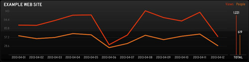

# Gauges Status Board Panel

This web application can be used to pull in analytics from the
[Gauges](http://gaug.es) service and display them on your
[Status Board](http://panic.com/statusboard).

## Configuration

To configure your own instance of this panel, you should be familiar with
running Sinatra or Ruby on Rails instances. Of course, if you are not familiar
with setting up and running a Sinatra web application, the easiest route is to
use [Heroku](http://heroku.com).

Please reference [this tutorial](https://devcenter.heroku.com/articles/git)
for more information about deploying to Heroku.

### Defining Your API Key

You will need to get an API key for your Gauges account by following the
instructions at [http://get.gaug.es/documentation/api/authentication/](http://get.gaug.es/documentation/api/authentication/).

Once you have your API key, you should update the `app.rb` file to include it,
like so:

    set :api_key, "<your api key>"

This step is optional, however, as you can always pass in your API key to the
app with the api_key request parameter. For example:

    https://<your-deployment-location>/traffic/<your-gauge-id>?api_key=<your-api-key>

## Usage

The only supported endpoint is the Traffic endpoint. To use, simply add a Graph
panel to your Status Board with a URL similar to the following:

    https://<your-deployment-location>/traffic/<your-gauge-id>

If you have not specified your API key in `app.rb`, your URL should look like:

    https://<your-deployment-location>/traffic/<your-gauge-id>?api_key=<your-api-key>

## Author

Developed by Justin Mecham ([email](mailto:justin@mecham.me),
[twitter](http://twitter.com/jsmecham)).

## License

This project is licensed under the terms of the MIT License.
